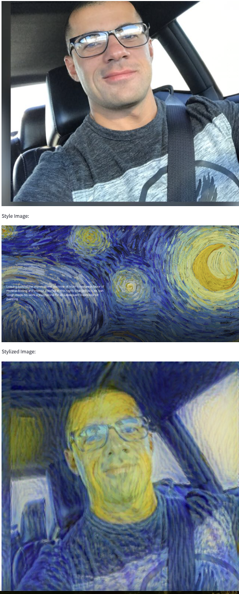

# Computer Vision Project

## Setup steps

1. setup a virtual python enviroment using conda<small>, optional but recommended </small>
   `conda create --name myenv python=3.8`

2. active the virtual enviroment<small>, optional but recommended </small>
   `conda activate myenv`

3. install all dependencies: `pip install -r requirements.txt`

4. run the app `streamlit run app.py`

5. upload a conent image and a style image and wait to see the result
